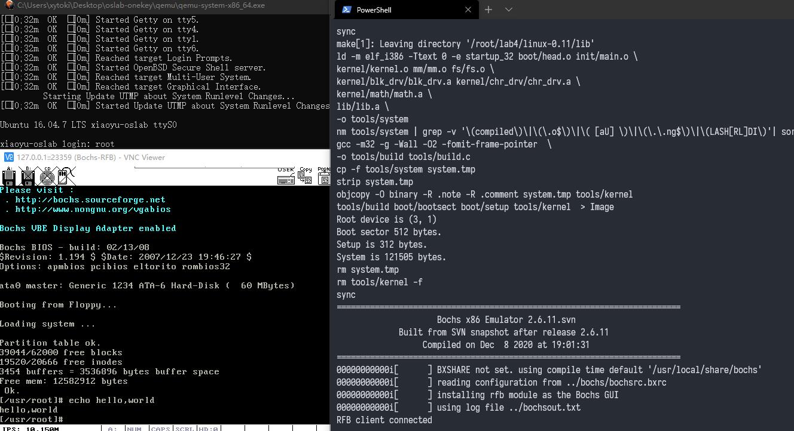
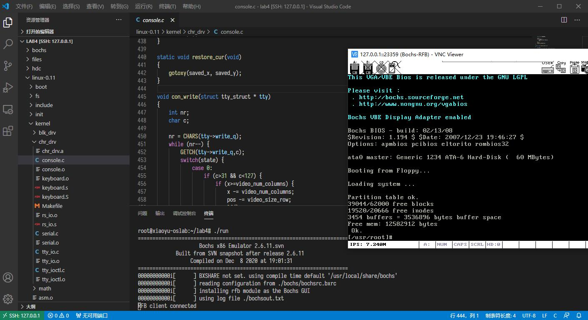
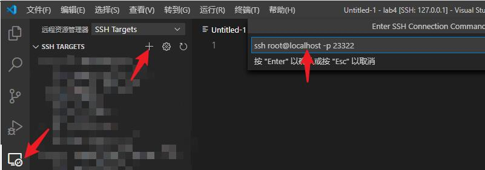
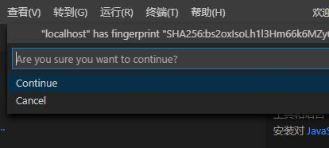
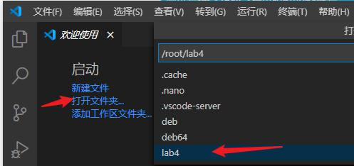
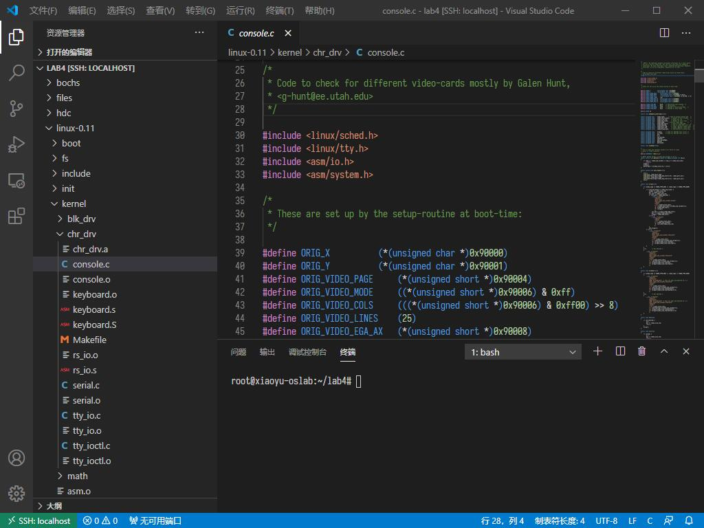
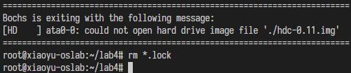

# CSAPP OSLAB win64集成开发一键包-晓羽

## 简介

以下所有内容都来自北京邮电大学晓羽师傅～在此仅作记录！

不用装虚拟机 不用装系统 不用装环境 开箱即开发 还能vscode remote
基于qemu+ubuntu-16.04 linux-5.4.0-56-generic x86_64 GNU/Linux gcc3.4
具体参考压缩包内readme

配合vscode remote ssh使用更佳

用法详见readme

## 下载：

http://xia.st/%E6%9F%8F%E6%B2%B9/oslab-onekey.7z

## Windows操作系统演示：

## vscode remote连接方法

## linux/mac宿主

如果是linux/mac宿主可以直接把里面的qcow2挂载了然后chroot进去用，这个是64位的环境。

## 其他问题

run之后连接vnc闪退，报错。

则执行rm *.lock之后再run再vnc。

vnc连接方式一致，在vscode的终端里./run然后双击一键包文件夹的连接模拟器.bat 或者用vnc-viewer连localhost::23359

