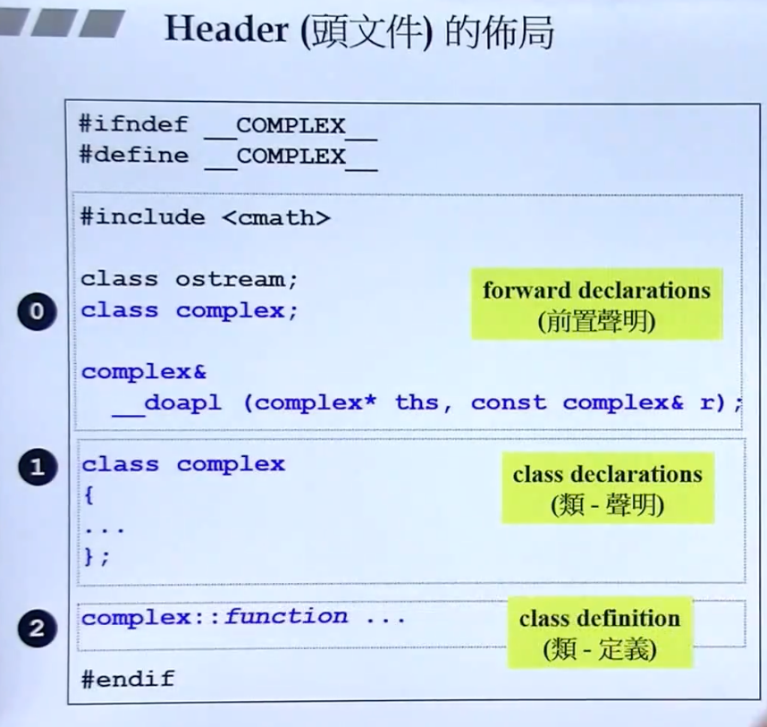
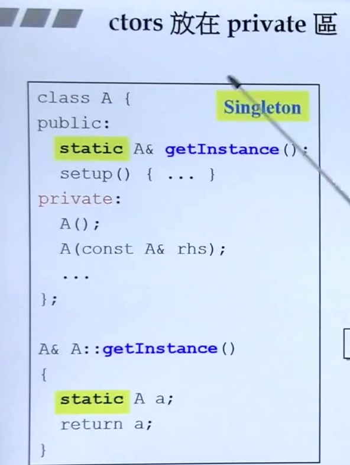
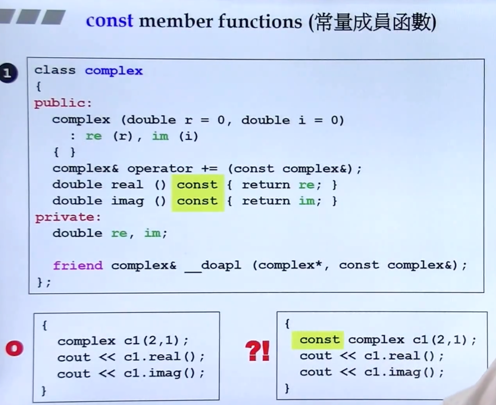
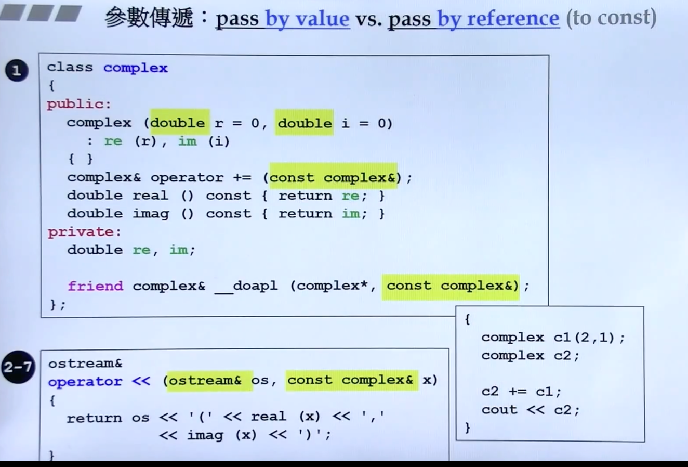
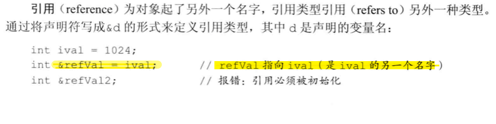
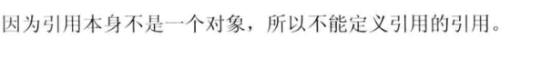
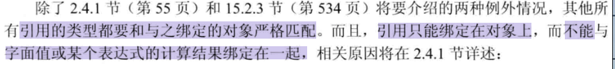
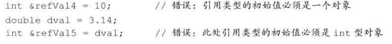
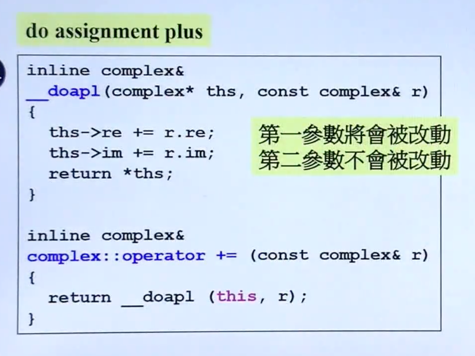
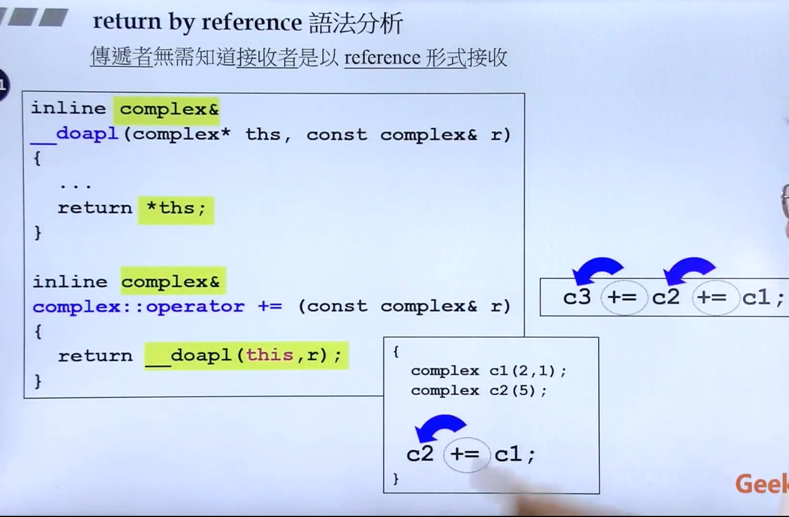

### Header（头文件）布局



### 防卫式声明 

``` cpp
#ifndef __COMPLEX__
#define __COMPLEX__
....
#endif
```

### 内联函数

inline

### 访问级别access level

public

Private 

### 构造函数 constructor


创建对象时，构造函数将被调用

函数名称与类的名称相同，可以拥有参数，参数可以有默认值，不需要返回值。

### Initialization list初值列

```cpp
complex (double r=0,double i=0)
  :re(r),im(i)
  {}
```

变量的赋值有两阶段：初始化、赋值。

在初始化中给值，提高效率。

析构函数

不带指针的不需要写析构函数

### 构造函数可以有很多个-overloading重载


  

### 单例模式singleton



只能有一份实例

创建实例时

`A::getInstance().setup();`

### 常量成员函数

const标注表示数据不能被修改  


### pass by value

直接传值

pass by reference(to const)

传首地址，传引用 

引用在底层相当于一个指针，所以传引用相当于传一个指针，但是形式又简洁漂亮。




### 引用










 

### 友元 friends

相同class的各个object互为friends


### 类的编写

数据private

传参reference

看情况做const

构造函数Initialization list

### return by reference  

设有两参数c1、c2

以下有两种情况 1:` c1=c1+c2;`  2:`int b =c1+c2;`

b是在函数中创建的，函数结束该变量即消亡，无法传出引用。



### 操作符重载

操作符是怎样被编译器看待的？

 操作符相当于一种函数 

任何一个成员函数都有一个隐藏的this pointer

### Return by reference 语法分析



