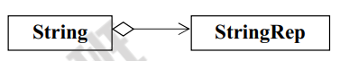
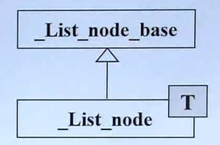
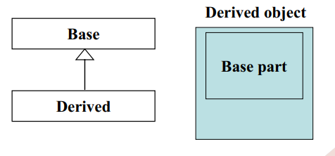

单件设计模式：保证一个类仅有一个实例，并提供一个访问它的全局访问点。单件设计模式在OGRE中使用还是比较频繁的，管理日志的LogManager，还有SkeletonManager等管理器，就连Root也使用了这种设计模式。分析OGRE的使用，发现这种设计模式是很简单的，如下：

 ```java
 template <typename T> class Singleton
  {
  protected:

​    static T* ms_Singleton;

  public:
    Singleton( void )
    {
      assert( !ms_Singleton );
      ms_Singleton = static_cast< T* >( this );
    }
    ~Singleton( void )
      { assert( ms_Singleton ); ms_Singleton = 0; }
    static T& getSingleton( void )
 { assert( ms_Singleton ); return ( *ms_Singleton ); }
    static T* getSingletonPtr( void )
 { return ms_Singleton; }
  };
}
 ```

接下来只要继承这个模板类并且重载getSingleton()，getSingletonPtr()，确实很方便，不是么^_^
STL就更不用说了，没有STL，OGRE恐怕就不是现在这个样子，说到这里，我对OGRE采用的STL命名法并不赞同，举个例子：
 typedef std::map<String, Log*, std::less<String> > LogList;  
这是一个map，却命名为LogList，STL内含list容器，很容易混淆，混淆的还在后面
 typedef std::vector<LogListener*>   LogListenerList;
明明是个vector，却命名为LogListenerList，如果整个工程统一使用这一风格，还可以接受，但下面这句就违反了
  typedef std::vector<String> StringVector;
这里使用了vector命名StringVector，我个人对这种命名比较认可，一目了然

``` cpp
#pragma  once 
#include  < memory > 
 using   namespace  std;
template < class  _Tr, class  _Ac > 
 class  singleton
 {
public:
    singleton()
    {
        if(m_ptr.get() == NULL)
        {
            m_ptr.reset(new _Tr());
        }
    }
    singleton(const _Ac& args)
    {
        if(m_ptr.get() == NULL)
        {
            m_ptr.reset(new _Tr(args));
        }
    }
    _Tr* operator->()const
    {
        return m_ptr.get();
    }
    _Tr& operator*()const
    {
        return *m_ptr;
    }
public:
    ~singleton(void)
    {
    }
private:
    static auto_ptr<_Tr> m_ptr;
} ;

template < class  _Tr, class  _Ac > 
auto_ptr < _Tr >  singleton < _Tr,_Ac > ::m_ptr;
```

●Iterator(迭代器)
意图: 提供一种方法顺序访问一个聚合对象中各个元素, 而又不需暴露该对象的内部表示。
示例: STL中的Containers与Iterator 
STL中，提供了很多总数据结构，为这些数据结构又定义了很多种统一迭代器,通过迭代器来访问数据结构的元素。这样就将数据的访问与数据的内部存储结构分隔开了，使所有的数据结构有共通的访问方式。

●Template Method(模板方法)
意图:定义一个操作中的算法的骨架，而将一些步骤延迟到子类中。Template Method使得子类可以不改变一个算法的结构即可重定义该算法的某些特定步骤。
示例:
这种模式在MFC源码中被大量使用。
典型的有: CView基类对WM_PANT消息的相应

```cpp
void CView::OnPaint()
{
//处理流程
CPaintDC dc(this);
OnPrepareDC(&dc);
OnDraw(&dc);
}
```

然后派生类实现OnPrepareDC,OnDraw完成具体的步骤。

●Bridge(桥接)
意图:将抽象部分与它的实现部分分离，使它们都可以独立地变化。
示例:MFC中的 (Serialization) 序列化机制
在序列化机制中,CArchive 和 CFile共同完成了数据的永久存储
CArchive定义了数据存取的共用接口
而CFile及其派生类 则完成了存储过程的具体实现(文件、内存缓冲区等等)
这样,数据存储的接口部分与具体实现部分被分离了。给CArchive搭配不同的CFile派生类就可实现不同的物理存储。

STL和ATL都有Template Method 和 Iterator。并且Template Method是最大量使用的设计模式。COM和ATL/MFC/STL不是同一回事吧？我觉得只是一种对象模型，如果考虑设计模式最多只能考虑这种模型的设计模式（当然这也很有意义），它和其它的一些库还是不能相提并论的。FMD提出这个问题非常有意义，这应该是另一种较为有效和高层次的学习方法。

学习模式之前，必须先意识到“模式不是Bible”，不然太容易陷入歧途了。请各位先看看《PMT评论》第17期关于“轻量级”的文章。
http://www.pmtsolution.net/pmtreview/issues/list.htm

 **(1) Composition(复合) 设计模式: have-a**

以STL中的queue为例:

queue依托于双端队列deque来实现, 用UML图可表示为:


　　像这样 一个对象依托于另一个对象来实现 为复合设计模式 

在复合设计模式下:

构造由内而外:

Container::Container(……): Component() { …… } ;
(Container的构造函数首先调用Component的default构造函数 然后才执行自己

析构由外而内:Container::~Container(……) { …… ~Component() } ;

(Container 的析构函数首先执行自己，然后才调用 Component 的
析构函数。 )**
**

**这样的构造和析构的顺序很大程度保证了复合模式的稳定.**

**(2)Delegation(委托) 设计模式: (Composition by reference)**

**通过指针来引用另一个实现的类:**

**UML图如下:**

****


　　

```
// file String.cpp``#include "String.hpp"``namespace` `{``class` `StringRep {``  ``friend` `class` `String;``  ``StringRep(``const` `char``* s);``  ``~StringRep();``  ``int` `count;``  ``char``* rep;``};``}` `String::String() { ... }``...
```

　　对比于前一种复合设计模式 它的好处在于不受被委托类的影响 被委托类即便修改了某个成员函数名, 也不需要在发起委托的类上修改. 

　　同时 String类的多个对象可以共享rep指针指向的对象 减少了内存的占用

**(3) Inheritance(继承) is-a**

 **UML图如下:**

 


　　该模式即子类的对象包含有父类的成分:



学习模式之前，必须先意识到“模式不是Bible”，不然太容易陷入歧途了。请各位先看看《PMT评论》第17期关于“轻量级”的文章。
http://www.pmtsolution.net/pmtreview/issues/list.htm